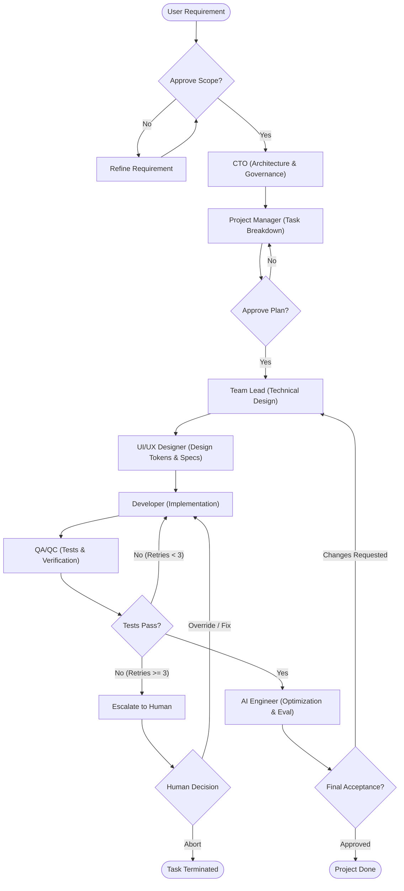

# Architecture Specification

## 1. Goal
ai-dev-org is a local-first, multi-agent AI software development organization environment running entirely on the user's local machine. The system orchestrates specialized software engineering roles using only the Gemini API via LiteLLM. It operates strictly without external database servers, cloud hosting, or third-party cloud infrastructure.

## 2. Agents
The organization consists of seven specialized roles:
- CTO (Chief Technology Officer): High-level system architecture, technology evaluation, security policies, and technical governance.
- Project Manager (PM): Requirements decomposition, sprint planning, milestone definition, and acceptance criteria.
- Team Lead: Task assignment, component technical design, dependency management, and workflow coordination.
- UI/UX Designer: User flows, component wireframing, design tokens, responsive layouts, and accessibility guidelines.
- Developer: Code implementation, refactoring, local unit testing, and component assembly.
- QA/QC Engineer: Test suite execution, integration verification, regression checks, and code quality audits.
- AI Engineer: Prompt engineering, LLM parameter optimization, retrieval/context tuning, and agent behavioral evaluations.

## 3. Workflow
The sequential and iterative pipeline proceeds as follows:
Requirement -> CTO -> PM -> Team Lead -> UI/UX -> Developer -> QA -> AI Engineer -> Done.

1. Requirement Ingestion: Raw user prompt or specification submitted via the UI.
2. CTO Architecture Review: Establishes technical feasibility, system boundaries, and architectural guidelines.
3. PM Task Breakdown: Converts architecture into granular, sequenced implementation tasks with acceptance criteria.
4. Team Lead Technical Planning: Allocates modules, defines contracts, and prepares execution context.
5. UI/UX Specification: Generates visual hierarchy, styling tokens, and frontend specifications.
6. Developer Implementation: Writes source files adhering to strict layer conventions.
7. QA/QC Verification: Validates compilation, executes test suites, and verifies acceptance criteria.
8. AI Engineer Optimization: Evaluates context window utilization, model behavior, and prompt efficacy.
9. Done: Artifacts finalized and staged for user acceptance.

## 4. Technology Stack
The stack is fixed across all modules:
- Backend Core: Python 3.11 with FastAPI for the HTTP and WebSocket API layer.
- Agent Orchestration: LangGraph using MemorySaver for state checkpointing.
- Model Layer: LiteLLM interfacing strictly with the Gemini API (gemini-1.5-pro, gemini-1.5-flash, gemini-2.0-flash).
- Storage: Local filesystem persistence using structured JSON and JSONL under `./data`.
- Semantic Search: Optional embedded ChromaDB for local vector memory without an external service.
- Frontend: Next.js 14 (App Router), TypeScript (strict mode), Tailwind CSS, shadcn/ui components, React Flow for workflow visualization, TanStack Query for state fetching, and Zustand for client store.

## 5. Persistence Architecture
There is no database server. All persistence is handled locally via the filesystem through `backend/app/memory/store.py`:
- Project Metadata: Stored as UTF-8 encoded, 2-space indented JSON files under `./data/projects/`.
- Message Logs: Append-only JSONL files under `./data/messages/` capturing agent communication histories.
- Agent Memory: Append-only JSONL files under `./data/memory/` storing episodic and working memory per project.
- Vector Index: Embedded ChromaDB storage under `./data/chroma/` for semantic retrieval. If ChromaDB is disabled (`USE_CHROMA=false`), keyword matching over JSONL is used.
- Atomic Writes: Every mutation writes to a temporary file (`.tmp`) before calling `os.replace` to guarantee atomic operations and prevent corruption.

## 6. Concurrency and In-Process Pub/Sub
The system operates as a single-process application:
- Event Bus: In-process communication uses `asyncio.Queue` implemented in `backend/app/api/events.py`.
- WebSocket Delivery: Real-time UI updates stream directly from the internal queue to connected browser clients.
- Single Worker: All operations run within the main event loop, eliminating multi-process race conditions and shared memory issues without Redis.

## 7. Observability
Observability is maintained locally without external SaaS dependencies:
- Trace Logging: Agent execution traces, token counts, latencies, and routing metrics are written to `./logs/langfuse.jsonl`.
- Sanitization: All API keys, tokens, and local secret credentials are automatically scrubbed prior to writing.
- Log Management: Structured JSONL format rotated whenever the log file size exceeds 50MB.

## 8. Failure and Retry Policy
To prevent infinite execution loops and cascading failures:
- Error Handling: Handled at both the LLM router and graph node levels.
- Max Retries: Failed model calls or validation errors allow up to 3 automated retries with exponential backoff on HTTP 429 and network timeouts.
- Model Fallback: Repeated reasoning failures fall back from `gemini-1.5-pro` to `gemini-1.5-flash` before error propagation.
- Escalation: After 3 failed attempts, the graph halts automated execution and transitions the task into an escalation state requiring human intervention.

## 9. Human-in-the-Loop (HITL) Points
Human review and approval gates are enforced at critical transitions:
- Requirement Approval: User confirms the initial project scope before the CTO triggers architecture synthesis.
- Plan Sign-off: User reviews and approves the PM task breakdown and technical milestones prior to code implementation.
- Escalation Resolution: When retries are exhausted or QA reports blocking defects, execution pauses for user direction.
- Final Review: User reviews generated artifacts and test verification reports before the project status transitions to Done.

## 10. Execution Flow Diagram

